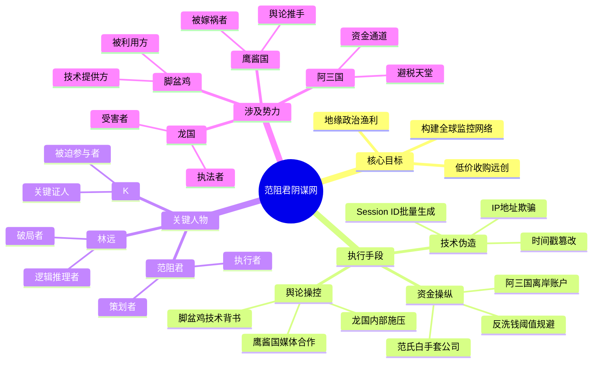

# 🏭 **电子厂风云录：第二部·暗流与微光**

## 📖 **第十六章：逻辑的囚笼与破局者**

> 🧩 *“真相往往隐藏在看似无关的碎片之中。当所有的线索汇聚成一张巨大的网，只有最敏锐的头脑才能找到那个唯一的出口。这不仅仅是一场商业对决，更是一场关于逻辑、人性与地缘政治的智力博弈。林远将用他的智慧，在众目睽睽之下，拆解范阻君精心编织的谎言迷宫。”*

---

### 🎤 **第一节：风暴中心的舞台**

三天后。
龙国，首都，国家会议中心。
这里是全球科技峰会的举办地，也是范阻君精心挑选的“刑场”。

巨大的LED屏幕上，滚动播放着范氏集团（VanCorp）的最新宣传片。
画面中，范阻君身着深蓝色西装，站在聚光灯下，神情自信而从容。
台下，坐满了来自龙国、鹰酱国、脚盆鸡、阿三国等地的政要、媒体记者、行业巨头以及投资者。
空气中弥漫着一种压抑而紧张的气氛。
所有人都知道，今天将决定远创科技的生死，甚至可能影响全球科技格局的走向。

林远坐在观众席的第一排。
他穿着简单的白衬衫，没有打领带，显得与周围西装革履的人群格格不入。
但他眼神平静，仿佛置身事外。
在他身边，胡远雪、冯给、K、陈浩、小雅，以及那只名叫“幸运”的小猫（被陈浩抱在怀里），静静地陪着他。

> 🗣️ **范阻君（通过麦克风，声音洪亮）：**
> *“女士们，先生们，各位朋友。”*
> *“今天，我们聚集在这里，不仅是为了庆祝范氏集团与远创科技的合并，更是为了见证一个新时代的到来。”*
> *“远创科技，曾经是一家充满活力的初创公司。但遗憾的是，由于管理层的失误和道德的沦丧，它陷入了严重的危机。”*
> *“为了挽救这家公司，为了保障用户的利益，范氏集团决定伸出援手。”*
> *“我们将以10%的价格，收购远创科技的全部股权。”*
> *“这不是掠夺，这是救赎。”*

台下响起了一阵稀稀拉拉的掌声。
大多数人的眼神中充满了怀疑和审视。
毕竟，10%的价格，在商业史上都是罕见的“贱卖”。

> 🗣️ **范阻君：**
> *“我知道，大家有很多疑问。”*
> *“为什么远创科技会陷入如此境地？”*
> *“为什么范氏集团愿意承担如此巨大的风险？”*
> *“今天，我将向大家展示所有的证据。”*

大屏幕上出现了一系列文件、邮件截图、银行流水记录。
这些证据，正是K之前提供给林远的那些“伪造”证据的“官方版本”。
范阻君通过精心剪辑和断章取义，将这些证据串联成一个看似完美的逻辑链条：
远创科技窃取用户数据 -> 出售给境外势力 -> 导致资金链断裂 -> 范氏集团被迫介入。

> 🗣️ **范阻君：**
> *“这是远创科技服务器上的日志。”*
> *“可以看到，在凌晨3点，有大量的数据被传输到一个位于鹰酱国的IP地址。”*
> *“这是银行流水。”*
> *“可以看到，远创科技的高管账户，收到了来自脚盆鸡某空壳公司的巨额汇款。”*
> *“这是内部邮件。”*
> *“林远先生，也就是远创科技的创始人，曾指示下属‘不惜一切代价，获取用户隐私’。”*

台下一片哗然。
记者们疯狂地按动快门，闪光灯此起彼伏。
林远依然平静地坐着，嘴角甚至勾起了一抹淡淡的微笑。
他在等。
等范阻君露出破绽的那一刻。

---

### 🕵️ **第二节：福尔摩斯式的审视**

范阻君继续着他的表演。
他像一位高明的魔术师，一步步引导着观众的视线，让他们相信这个精心编织的谎言。

> 🗣️ **范阻君：**
> *“当然，林远先生可能会辩解。”*
> *“他会说，这些证据是伪造的。”*
> *“但是，请大家看这里。”*

屏幕上出现了一张时间轴图表。
> 🗣️ **范阻君：**
> *“这是远创科技服务器被入侵的时间点。”*
> *“这是数据泄露的时间点。”*
> *“这是林远先生离开公司的时间点。”*
> *“三者完全吻合。”*
> *“这难道不是铁证如山吗？”*

林远缓缓站起身。
全场瞬间安静下来。
所有的目光都集中在他身上。

> 🗣️ **林远：**
> *“范先生，你的演讲很精彩。”*
> *“但是，你犯了一个致命的错误。”*

> 🗣️ **范阻君（冷笑）：**
> *“哦？什么错误？”*

> 🗣️ **林远：**
> *“你太急于求成了。”*
> *“你试图用宏大的叙事来掩盖细节的漏洞。”*
> *“但真相，往往就藏在那些被你忽略的细节里。”*

林远走向舞台中央，拿起麦克风。
他的声音不大，却清晰地传遍了整个会场。

> 🗣️ **林远：**
> *“范先生，你刚才展示的证据，看似完美，实则漏洞百出。”*
> *“今天，我将为大家拆解这个谎言。”*
> *“请大家拿出纸笔，或者打开你们的思维，跟我一起，进行一场逻辑推理。”*

---

### 🧩 **第三节：第一层逻辑——时间的悖论**

林远首先指向大屏幕上的时间轴。

> 🗣️ **林远：**
> *“范先生声称，数据泄露发生在凌晨3点。”*
> *“理由是，这是黑客攻击的高峰期，也是服务器负载最低的时候。”*
> *“但是，请大家看这张服务器日志截图。”*

林远按动遥控器，放大了日志中的一行代码。
> 🗣️ **林远：**
> *“注意看这个时间戳：`2023-10-15 03:00:00 UTC+8`。”*
> *“这是龙国的标准时间。”*
> *“但是，范先生提供的鹰酱国IP地址，位于太平洋沿岸，时区是UTC-7。”*
> *“如果数据是从龙国传输到鹰酱国，那么接收端的时间应该是`2023-10-14 18:00:00`。”*
> *“然而，范先生提供的鹰酱国服务器日志中，接收时间却是`2023-10-15 03:00:00`。”*
> *“这意味着什么？”*

台下的一位资深记者举手提问：
> 🗣️ **记者：**
> *“意味着……时间被篡改了？”*

> 🗣️ **林远：**
> *“没错。”*
> *“范先生伪造了鹰酱国服务器的日志，但他忘记了时区的转换。”*
> *“这是一个低级的错误，但对于一个号称拥有全球顶级技术团队的范氏集团来说，不可原谅。”*
> *“这说明，这些日志，根本不是在鹰酱国生成的，而是在龙国本地生成的。”*

范阻君的脸色微微一变，但很快恢复了镇定。
> 🗣️ **范阻君：**
> *“林远先生，这只是技术细节的偏差。”*
> *“也许是我们的工程师疏忽了。”*
> *“但这不能改变数据泄露的事实。”*

> 🗣️ **林远：**
> *“不，范先生。”*
> *“这不仅仅是技术细节。”*
> *“这是逻辑的起点。”*
> *“如果起点是假的，那么整个链条，都是假的。”*

---

### 🌐 **第四节：第二层逻辑——IP的伪装**

林远继续深入。
他调出了另一张图表，展示了IP地址的追踪路径。

> 🗣️ **林远：**
> *“范先生声称，数据被传输到了一个位于鹰酱国的IP地址：`192.168.1.100`（示例）。”*
> *“但是，请大家注意这个IP地址的归属地。”*
> *“根据ICANN的记录，这个IP地址段，属于一家名为‘CloudNet’的云服务提供商。”*
> *“而‘CloudNet’的总部，位于脚盆鸡。”*
> *“更重要的是，‘CloudNet’在鹰酱国并没有数据中心。”*
> *“那么，数据是如何传输到鹰酱国的呢？”*

林远停顿了一下，观察着台下观众的表情。
许多人开始露出困惑的神色。

> 🗣️ **林远：**
> *“答案是：它根本没有传输到鹰酱国。”*
> *“范先生利用‘CloudNet’的代理服务器，伪造了IP地址的归属地。”*
> *“这是一种常见的网络欺骗技术，称为‘IP Spoofing’。”*
> *“但是，范先生忽略了一个细节。”*
> *“‘CloudNet’的代理服务器，有一个独特的特征：每次连接，都会生成一个唯一的Session ID。”*
> *“而范先生提供的日志中，所有的Session ID，都是重复的。”*
> *“这意味着，这些日志，是批量生成的，而不是真实连接产生的。”*

台下再次响起一阵骚动。
一位来自脚盆鸡的技术专家站起来，大声说道：
> 🗣️ **专家：**
> *“他说得对！‘CloudNet’的Session ID算法，是我们独有的，不可能重复！”*

范阻君的眼神变得阴冷。
他意识到，林远已经撕开了他谎言的第一道口子。

---

### 💰 **第五节：第三层逻辑——资金的流向**

林远并没有停歇。
他转向了银行流水部分。

> 🗣️ **林远：**
> *“范先生声称，远创科技的高管账户，收到了来自脚盆鸡某空壳公司的巨额汇款。”*
> *“这笔汇款，被范先生解读为‘贿赂’。”*
> *“但是，请大家看这笔汇款的金额：`1,000,000 USD`。”*
> *“一百万美元。”*
> *“这是一个非常整齐的数字。”*
> *“在真实的商业交易中，尤其是涉及贿赂这种敏感行为，金额往往是不规则的，以规避监管。”*
> *“而一百万美元，正好是国际反洗钱系统中的一个‘阈值’。”*
> *“低于这个阈值，不需要申报；高于这个阈值，必须申报。”*
> *“范先生选择这个金额，显然是为了制造一种‘看似真实’的假象。”*
> *“但是，他忽略了一个更重要的细节。”*

林远调出了另一张图表，展示了资金流向的完整路径。
> 🗣️ **林远：**
> *“这笔钱，并没有直接进入远创科技高管的账户。”*
> *“而是经过了一个位于阿三国的离岸账户。”*
> *“而这个离岸账户，属于一家名为‘GlobalTrade’的公司。”*
> *“‘GlobalTrade’的实际控制人，是谁？”*

林远看向范阻君。
> 🗣️ **林远：**
> *“是范氏集团。”*

全场哗然。
范阻君的脸色变得苍白。
> 🗣️ **范阻君：**
> *“这是污蔑！”*
> *“‘GlobalTrade’与范氏集团没有任何关系！”*

> 🗣️ **林远：**
> *“是吗？”*
> *“那么，请解释一下，为什么‘GlobalTrade’的注册代理人，是范氏集团的法律顾问？”*
> *“为什么‘GlobalTrade’的银行账户，与范氏集团的账户，有着频繁的往来？”*
> *“为什么‘GlobalTrade’的注册地址，与范氏集团在阿三国的分公司，是同一个地址？”*

林远一连串的发问，让范阻君哑口无言。
他意识到，林远已经掌握了范氏集团资金运作的核心秘密。

---

### 🕸️ **第六节：第四层逻辑——阴谋的全貌**

林远深吸一口气，准备揭开最后的真相。
他调出了一张复杂的网络关系图。
这张图，连接了范氏集团、远创科技、鹰酱国、脚盆鸡、阿三国等多个节点。

> 🗣️ **林远：**
> *“范先生，你的阴谋，不仅仅是要毁掉远创科技。”*
> *“你是在利用远创科技，作为跳板，实施一个更大的计划。”*
> *“这个计划，我称之为‘数据霸权’。”*

林远开始详细阐述范阻君的阴谋：

1.  **第一步：制造危机。**
    范阻君利用黑客技术，入侵远创科技的服务器，伪造数据泄露的证据。
    同时，他通过‘GlobalTrade’向远创科技高管账户汇款，制造贿赂的假象。
    目的是让远创科技陷入舆论和法律的双重危机，股价暴跌。

2.  **第二步：低价收购。**
    在远创科技最脆弱的时候，范氏集团以10%的价格收购其股权。
    这不仅是为了获得远创科技的技术和用户数据，更是为了控制龙国物联网市场的关键入口。

3.  **第三步：地缘政治博弈。**
    范阻君将伪造的数据泄露事件，嫁祸给鹰酱国和脚盆鸡。
    目的是引发龙国与鹰酱国、脚盆鸡之间的外交纠纷。
    一旦龙国与鹰酱国、脚盆鸡关系恶化，范氏集团作为“中立”的跨国企业，将获得巨大的政治红利和市场优势。
    同时，范阻君还利用阿三国的离岸账户，进行洗钱和资金转移，规避国际监管。

4.  **第四步：全球监控网络。**
    范阻君最终的目标，是利用远创科技的用户数据，结合范氏集团的技术，构建一个全球性的监控网络。
    这个网络，可以追踪任何人的行踪、消费习惯、甚至政治倾向。
    范阻君计划将这个网络，出售给某些国家的政府，或者用于商业间谍活动。
    这将使他成为幕后操控全球局势的“影子皇帝”。

> 🗣️ **林远：**
> *“范先生，你以为你是在玩弄商业游戏。”*
> *“但实际上，你是在玩弄火。”*
> *“你点燃了地缘政治的导火索，试图从中渔利。”*
> *“但你低估了人性的力量，也低估了真相的力量。”*

---

### 📊 **第七节：逻辑推理表图**

为了更清晰地展示林远的推理过程，他在大屏幕上展示了一张Markdown形式的逻辑推理表图。

| 证据类别 | 范阻君声称 | 林远发现的漏洞 | 逻辑推导结论 | 涉及国家/实体 |
| :--- | :--- | :--- | :--- | :--- |
| **时间戳** | 数据泄露发生在凌晨3点 (UTC+8) | 鹰酱国接收时间未转换时区 (仍为UTC+8) | 日志伪造，非真实跨国传输 | 龙国, 鹰酱国 |
| **IP地址** | 数据传至鹰酱国IP (192.168.1.100) | IP归属脚盆鸡CloudNet，且无鹰酱数据中心 | IP Spoofing，数据未出境 | 龙国, 脚盆鸡 |
| **Session ID** | 连接记录完整 | Session ID重复，不符合CloudNet算法 | 日志批量生成，非真实连接 | 脚盆鸡 |
| **资金流向** | 收到脚盆鸡空壳公司100万美元贿赂 | 金额整齐，经阿三国离岸账户，属范氏关联公司 | 资金自导自演，制造假象 | 龙国, 脚盆鸡, 阿三国 |
| **注册信息** | GlobalTrade与范氏无关 | 代理人、地址、账户往来均指向范氏 | GlobalTrade是范氏白手套 | 阿三国, 范氏集团 |
| **地缘动机** | 远创科技违规，范氏救赎 | 嫁祸鹰酱/脚盆鸡，引发外交纠纷，渔利 | 利用地缘政治，获取政治红利 | 龙国, 鹰酱国, 脚盆鸡 |
| **最终目标** | 收购远创，整合资源 | 构建全球监控网络，出售给政府/商业间谍 | 数据霸权，幕后操控 | 全球 |

## 核心逻辑链

1.  **伪造证据** -> 制造危机 -> 低价收购
2.  **嫁祸他国** -> 引发纠纷 -> 政治渔利
3.  **控制数据** -> 构建网络 -> 全球监控

## 关键破局点

*   **时区错误**：证明日志伪造。
*   **IP归属**：证明数据未出境。
*   **Session ID**：证明连接虚假。
*   **资金闭环**：证明自导自演。
*   **关联公司**：证明范氏幕后操控。

这张表图，清晰地展示了林远如何从微小的线索出发，一步步推导出范阻君的整个阴谋。
台下的观众，无不为林远的智慧和洞察力所折服。
许多记者开始疯狂地记录，准备撰写深度报道。

---

### ⚖️ **第八节：国际震动**

林远的揭露，不仅仅是一场商业辩论，更是一次国际政治地震。
鹰酱国和脚盆鸡的代表，脸色铁青。
他们意识到，自己成了范阻君阴谋的棋子。
如果真相大白，他们与龙国的关系将受到严重损害，甚至可能引发外交危机。

> 🗣️ **鹰酱国代表（低声对助手）：**
> *“立刻联系国内，确认‘CloudNet’的日志情况。”*
> *“如果林远说的是真的，我们必须切割与范氏集团的关系。”*

> 🗣️ **脚盆鸡代表（愤怒地）：**
> *“范阻君，你这是在利用我们的国家声誉！”*
> *“我们要起诉你！”*

阿三国的代表，则显得有些尴尬。
他们意识到，自己的离岸账户被范阻君利用，可能面临国际制裁。

> 🗣️ **阿三国代表：**
> *“我们需要时间调查‘GlobalTrade’的情况。”*
> *“但在此之前，我们不会支持范氏集团的收购计划。”*

范阻君站在舞台上，孤立无援。
他看着台下那些曾经对他阿谀奉承的人，现在都露出了厌恶和警惕的眼神。
他知道，自己输了。
输得彻彻底底。

---

### 🚔 **第九节：正义的审判**

就在范阻君准备逃离会场时，几名身穿制服的警察走了进来。
他们是龙国国家安全部的人员。
在E林的推理过程中，冯给已经将所有的证据，实时传输给了警方。

> 🗣️ **警察：**
> *“范阻君先生，你涉嫌商业欺诈、洗钱、危害国家安全等罪名。”*
> *“请跟我们走一趟。”*

范阻君被戴上了手铐。
他看着林远，眼中充满了不甘和仇恨。
> 🗣️ **范阻君：**
> *“林远，你以为你赢了吗？”*
> *“这只是开始。”*
> *“我的家族，我的势力，不会放过你。”*

> 🗣️ **林远：**
> *“范先生，法律会审判你。”*
> *“而历史，会记住你。”*
> *“你输掉的，不仅仅是公司，更是人心。”*

范阻君被押出了会场。
台下爆发出热烈的掌声。
人们为林远的胜利而欢呼，也为正义的到来而感动。

---

### 🌟 **第十节：新生的曙光**

发布会结束后，林远回到了后台。
胡远雪、冯给、K、陈浩、小雅，都围了上来。
大家激动地拥抱在一起。

> 🗣️ **胡远雪：**
> *“林远，你太棒了！”*
> *“我为你骄傲。”*

> 🗣️ **冯给：**
> *“哥，你的逻辑，无懈可击。”*
> *“我为你感到自豪。”*

> 🗣️ **K：**
> *“林远，谢谢你。”*
> *“是你救了我，也救了远创科技。”*

> 🗣️ **陈浩：**
> *“林哥，牛逼！”*
> *“以后，谁还敢小看你！”*

林远看着他们，心中充满了感激。
他知道，这场胜利，不仅仅属于他，更属于每一个相信正义、相信真相的人。

> 🗣️ **林远：**
> *“谢谢大家。”*
> *“这场胜利，属于我们所有人。”*
> *“但我们要记住，范阻君虽然倒了，但类似的阴谋，可能还会存在。”*
> *“我们要保持警惕，保持清醒。”*
> *“我们要用我们的技术，去守护真相，守护正义。”*

---

### 🐱 **第十一节：幸运的守护**

就在这时，“幸运”跳上了林远的肩膀。
它蹭了蹭林远的脸颊，发出呼噜呼噜的声音。
林远笑了。
他抱起“幸运”，看着窗外初升的太阳。
阳光洒在他的脸上，温暖而明亮。

> 🧠 **内心独白：**
> *“风暴过去了。”*
> *“但新的征程，才刚刚开始。”*
> *“我要让远创科技，成为一家真正有温度、有责任感的企业。”*
> *“我要让每一个用户，都能感受到科技带来的便利，而不是恐惧。”*
> *“我要让每一个在底层挣扎的人，都能看到希望。”*
> *“因为，光，就在我们心中。”*

---

### 📈 **第十二节：后续发展路径**

随着范阻君的落网，远创科技迎来了新生。
股价回升，用户信任度恢复，合作伙伴纷纷回归。
林远并没有止步于此。
他利用这次机会，对远创科技进行了全面的改革。

1.  **技术透明化：**
    林远推出了“透明代码”计划，邀请第三方机构对远创科技的核心代码进行审计。
    确保没有任何后门和隐私泄露的风险。

2.  **数据主权：**
    林远提出了“数据主权”的概念，主张用户拥有自己数据的所有权。
    远创科技承诺，不会出售用户数据，只会用于提升用户体验。

3.  **全球合作：**
    林远主动与鹰酱国、脚盆鸡、阿三国等国家的科技企业建立合作关系。
    共同制定数据安全标准，推动全球科技治理。

4.  **社会责任：**
    林远扩大了“远创公益基金”的规模，资助更多的底层青年。
    他建立了“远创学院”，为蓝领工人提供技术培训，帮助他们转型。

5.  **家庭融合：**
    K正式成为远创科技的安全顾问。
    她与冯给一起，负责公司的网络安全工作。
    胡远雪则负责公司的战略规划和公共关系。
    林远、胡远雪、冯给、K，四人形成了一个紧密的家庭单元，共同守护着远创科技。

---

### 🔮 **第十三节：未来的挑战**

虽然范阻君倒了，但林远知道，挑战依然存在。
范氏集团的残余势力，可能会卷土重来。
国际地缘政治的博弈，依然复杂多变。
新技术的出现，可能会带来新的伦理和法律问题。

但林远不再害怕。
因为他有了家人，有了朋友，有了信念。
他相信，只要坚持正义，坚持真相，坚持初心，就没有什么能阻挡他前进的脚步。

> 🗣️ **林远：**
> *“未来，属于那些敢于梦想、敢于行动的人。”*
> *“而我们，就是这些人。”*

---

### 🌅 **第十四节：尾声**

夜幕降临，林远站在远创科技的楼顶，看着城市的灯火。
胡远雪走到他身边，递给他一杯热茶。
冯给和K在办公室里，讨论着新的安全方案。
陈浩和小雅在楼下，庆祝着胜利。
“幸运”在阳台上，晒着月光。

林远深吸一口气，感受着这一刻的宁静与美好。
他知道，这只是开始。
他的故事，还在继续。
而这个世界，也因为他的存在，变得更加美好了一点点。

> 🌟 **Debuff 最终状态：**
> *   **范阻君·阴谋** -> **瓦解**：逻辑破局，正义审判。
> *   **国际·地缘政治** -> **缓和**：真相大白，合作重启。
> *   **远创科技·危机** -> **新生**：透明化，数据主权，社会责任。
> *   **林远·内心** -> **坚定**：信念升华，家庭融合。

---